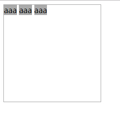

# 为什么会有间隔?

```
  <style>
    .box{
      width: 200px;
      height: 200px;
      border: 1px solid #aaa;
    }
    span{
      background-color: #aaa;
    }
  </style>

  <div class="box">
    <span>aaa</span>
    <span>aaa</span>
    <span>aaa</span>
  </div>

```



块框中说明，一个块框中要么都是块框，要不都是行内框(inline box)

三个span都是行内框，所以会按照行内框来渲染

行内框里面都是文本，渲染文本字体有大小

空白字符(空格，换行，tab)会被当作一个空格处理，这个空格就回被当作一个`字符`对待，所以会有间隙

解决方式
----------------------
box设置`font-size:0`,span重新指定字体大小,字体大小为零，也就是不会占据空间，所以可以消除间隙
--------------------
浮动
----------


# img下几像素空白产生原因


img是inline元素，`默认是baseline对齐的`

baseline不是最底部，所以底部会有一部分空白

解决方式:
- vertical-align:bottom
- 父容器,font-size设置为0


https://segmentfault.com/q/1010000000441100


#font-size:0有什么作用?

对可替换元素，无效

对不可替换元素来说，font-size决定了字体的大小(ex-square的高度),如果为零，那么`字体高度就为零`了

`宽度也自然为零`

可以`移除`该元素

------------------------

由于line-height如果是数字，那么line-height的实际高度是根据font-size计算而来的

那么也会导致行号为零，可能会导致父元素高度为零

--------------
由于font-size是可继承的，所以，一个父元素如果设置为0，所有子元素会被`移除`，然后更具需要在给子元素重新设定font-size，这种方式经常用来移除空白符的影响


[https://www.zhangxinxu.com/wordpress/2012/04/inline-block-space-remove-%E5%8E%BB%E9%99%A4%E9%97%B4%E8%B7%9D/](https://www.zhangxinxu.com/wordpress/2012/04/inline-block-space-remove-%E5%8E%BB%E9%99%A4%E9%97%B4%E8%B7%9D/)


