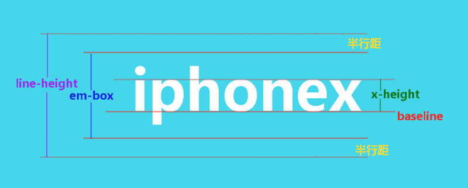

# 字体

# 字体大小和字体高度

`font-size:20px`,实际`字体高度`是多少？
--------------
这个无法确定，font-size设置的仅仅是em-box的高度，不是字体整体的高度

## em-box

em-box是`文字的主体区域`，font-size则直接设置这个区域的高度

`font-size:2em`,单位`em`说的是em-box的高度

## content-area

然而每个字体在设计的时候，上下都会留有一定的空隙，这个空隙完全由字体设计者来制定

content-area=上下间隙+em-box

当你按住鼠标左键选中一段文字的时候，这段文字背后会有一个颜色变化的区域，这个区域可以近似的视为是这段文字的content-area（内容区域）

我们通常用content-area的高度代表`文字高度`

--------------------

font-size 相同时，font-family 不同，得到的文字高度也不同

font-size不能直接控制文字的高度(content-area的高度)，它控制的是文字主体部分的高度(em-square的高度)

而content-area和em-square之间的比例，完全是由字体设计师决定，作为程序员是无法统一的。

# 总结

- 文字高度和font-size只有间接的关系
- font-size设置的是em-box的高度

# links

- [https://segmentfault.com/a/1190000014421021](https://segmentfault.com/a/1190000014421021)
- [https://alexzhong22c.github.io/2018/02/06/height-calculate/](https://alexzhong22c.github.io/2018/02/06/height-calculate/)