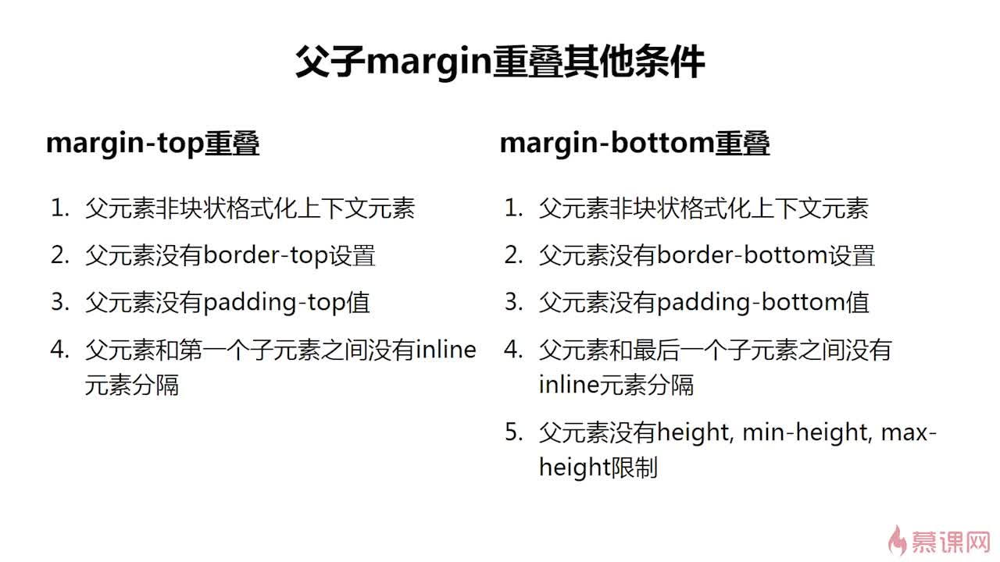
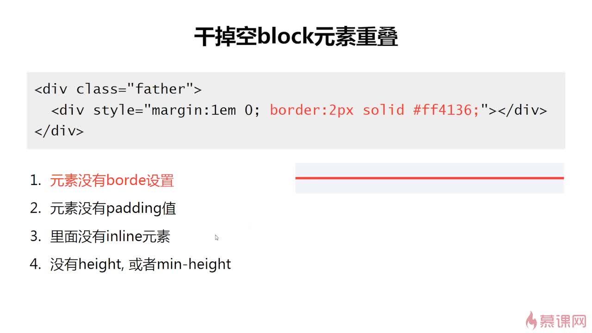

# margin

### 修改可视尺寸

margin会修改元素自身的尺寸(clientWidth)

- 适用于`没有设定width/height`的普通元素
- 只适用于水平方向

### 占据尺寸

margin会修改元素占据的尺寸(outerWidth)

# margin & 百分比

`margin-top:10%`这个10%是按照contain box的宽度来计算的

只要是百分比的单位，都是按照宽度来计算的

# margin 重叠

满足条件
- 常规流中的block元素(absloute，float都不可以)
- 只在垂直方向产生

三种情况

- 相邻的兄弟元素
- 父元素和第一个/最后一个子元素
- 空的block元素

计算规则

- 正正取大
- 正负向加
- 负负取小

### 父元素和第一个/最后一个子元素

这个不容易产生，条件很多

### 空的block元素

# margin auto

auto在这里表示的剩余空间的分配

剩余空间的产生，是由于width的设置，会产生剩余空间

如果一侧是定值，一侧是auto，则auto是剩余空间大小

如果两侧都是auto，那么会平分剩余空间(水平居中)

# margin 负值

margin 负值经常用在布局上

#  布局
