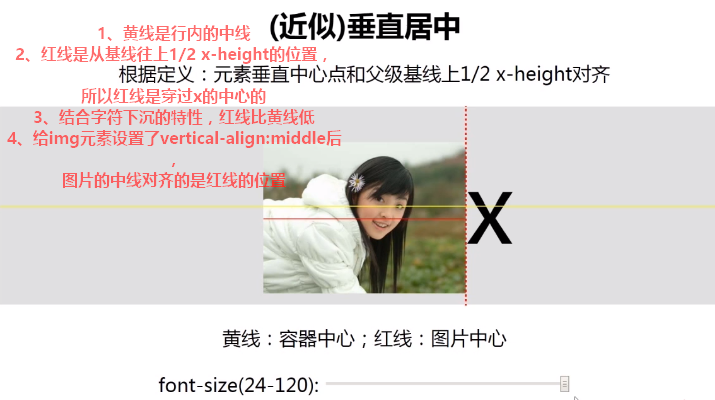

# vertical-align

w3c:行内元素的基线相对于该元素所在行的基线的垂直对齐方式

简单说就是两条基线对齐方式

属性有很多

- baseline(default):
- middle:元素的中心线和父元素基线上方1/2 x-height处对齐
- top:把元素的顶端与行中最高元素的顶端对齐
- bottom:
- .....

# 使用前提
vertical-align有使用前提的，就是元素必须是

- inline/inline-block
- table-cell

只有这两类，设置才会有意义

对块级元素设置没用的

# 垂直居中

垂直居中用的最多

`vertical-align:middle`是近似垂直居中，不是绝对垂直居中

文字"x"的中心高度(即基线往上1/2 x-height处) 比line-height的中线高度要低。有些人称这种现象为"字符下沉"

# 完美垂直居中

- font-size:0

# links
- [https://www.cnblogs.com/hykun/p/3937852.html](https://www.cnblogs.com/hykun/p/3937852.html)
- [https://alexzhong22c.github.io/2018/02/05/vertical-align-middle/](https://alexzhong22c.github.io/2018/02/05/vertical-align-middle/)