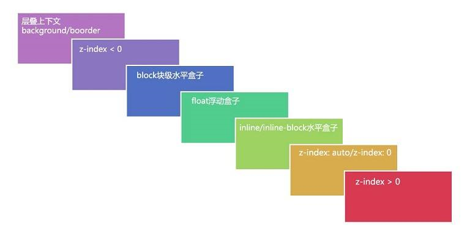

# z-index

z-index指定元素在`当前堆叠上下文`中的堆叠层级


# 分层渲染

从浏览器的角度来看

就是将html形成的`html tree数据结构`和`style tree数据结构`转化成`bitmap`

比如

```
<!DOCTYPE html>
<html lang="en">
  <head>
  </head>
  <body>
    <div class="box">
      <div class="item ">item</div>
      <div class="item ">item</div>
    </div>
  </body>
</html>
```
`先不考虑css`

在渲染的时候，`会按照html的结构`会形成一个类似这样的`数据结构`:


```
{
    html:{
        body:{
            box:{
                item:{
                    text:'item'
                },
                item:{
                    text:'item'
                }
            }
        }
    }
}

```
从外到里，从上到下的`根据css指令渲染`

类似:`html->body->.box->[.item(第一个)->文字]->[.item(第2个)->文字]`

body渲染的bitmap是在html渲染出来的bitmap的基础上绘制的

以此类推

最终形成渲染好的页面

这是默认的渲染顺序

# 重叠

渲染的时候，会有重叠的情况发生，比如`<div>xxx</div>`

但是按照上面的顺序来的话，符合我们的需求:文本最后渲染，不会被覆盖

----------------------

但是有了定位方案后，情况就不一样了

css引入了三种定位方案，都可能产生重叠

- 文档流
- 浮动
- 绝对定位

# 文档流

普通文档流，会按照上面的顺序来进行渲染

但是普通文档流中也会产生重叠

比如

```
<style>
.item{
    width: 100px;
    height: 100px;
    background-color: #aaa;
    border: 1px solid #f00;
}
</style>

<div class="box">
    <div class="item " style="margin:-30px;" >float</div>
    <div class="item ">posa</div>
</div>
```

负margin会拉伸元素，产生重叠

但是浏览器不会修改渲染顺序，还是按照DOM结构进行渲染

这样就会产生一种现象

`后面的覆盖前面的`


# 浮动

```
<div class="box">
    <div class="item " style="float:left;">float</div>
    <div class="item "  >normal</div>
</div>
```
如果一个元素应用了浮动

因为浮动是漂浮在文档流之上的，

所以没有东西可以挡住float元素(暂时不考虑绝对定位),想要实现这种效果，只需要将`float元素放到列表最后即可`

```
box:{
    item:{
        text:'item',
    },
    item:{
        text:'item'//浮动
    }
}
```


# 绝对定位

绝对定位和浮动类似

也是通过修改数据结构的顺序，来达到在文档流之上的效果

浮动和绝对定位有一点不同

绝对定位是单独一个图层，而浮动是所有浮动元素一个图层

虽然两个浮动元素也可能产生层叠，但是这种情况很少

然而绝对定位不一样

层叠的情况发生的情况很多

这有时候不一定满足我们的要求

# z-index

css提供了一个`z-index`来修改`定位元素的数据结构的顺序`来达到指定的层叠效果

比如:
```
{
    html:{
        body:{
            box:{
                item:{
                    text:'item'//第2个,z-index:1
                },
                 item:{
                    text:'item'//第1个,z-index:2
                },
            }
        }
    },
}
```


注意，z-index修改的仅仅是`同级的顺序`

还有一个问题

参照哪个元素?


默认的参照对象是html，但是都是html的话，那么可能造成混乱，比如100个元素都设置了z-index，那么这可能会导致哪个在上，哪个在下无法确定

所以，css还引入了这样一个概念，`层叠上下文`

简单说，层叠上下文就是参照对象，可以由css来设定

一般,设置`z-index`不为数字的元素，就是一个层叠上下文

这样比较`z-index`的时候就很简单了，先比较父元素，在比较子元素

做到了`z-index隔离`


# 总的渲染顺序

综上，影响数据结构顺序的因素一共如下，越大级别越高

- 1、层叠上下文 background/border
- 2、负z-index
- 3、block块级元素
- 4、float浮动元素
- 5、inline/inline-block行内元素
- 6、z-index:auto或者z-index:0（不依赖z-index的层叠上下文 看6.3）
- 7、正z-index




这个顺序好理解

inline元素在block的顶上，不然文字永远看不到

backgroud/border在最底下，如果在上面，那么可能会覆盖内容了


# 层叠上下文(stacking context)
从数据结构来看，层叠上下文就是一个参照对象，对计算层级很有用处

# 层叠等级,层叠水平(stacking level)

- 后来居上(DOM后面覆盖前面的)
- 谁大谁上(z-index大的在上面)

这个从数据结构看，更本不需要解释


# 层叠顺序(stacking order)

- 1、层叠上下文 background/border
- 2、负z-index
- 3、block块级元素
- 4、float浮动元素
- 5、inline/inline-block行内元素
- 6、z-index:auto或者z-index:0（不依赖z-index的层叠上下文 看6.3）
- 7、正z-index

这里的层叠顺序，本质上就是`影响排列`的`7个因素`而已

----------------


# 形成层叠上下文

- 根元素 (HTML),
- z-index 值不为 "auto"的 绝对/相对定位，
- 一个 z-index 值不为 "auto"的 flex 项目 (flex item)，即：父元素 display: flex|inline-flex，
- opacity 属性值小于 1 的元素（参考 the specification for opacity），
- transform 属性值不为 "none"的元素，
- mix-blend-mode 属性值不为 "normal"的元素，
- filter值不为“none”的元素，
- perspective值不为“none”的元素，
- isolation 属性被设置为 "isolate"的元素，
- position: fixed
- 在 will-change 中指定了任意 CSS 属性，即便你没有直接指定这些属性的值（参考 这篇文章）
- -webkit-overflow-scrolling 属性被设置 "touch"的元素


# 其他
z-index只对指定了 positioned属性的元素有效

当没有指定z-index的时候， 所有元素都在会被渲染在默认层(0层)


子元素的 z-index 值只在父级层叠上下文中有意义


分辨出层叠的元素在 Z 轴上的渲染顺序的一个简单方法是将它们想象成一系列的`版本号`，


每个HTML元素都属于一个层叠上下文


# 页面层级

微信中，页面的层次一共四层

- popout
- mask
- navigation
- content


  
# links
- [https://webdesign.tutsplus.com/zh-hans/articles/what-you-may-not-know-about-the-z-index-property--webdesign-16892](https://webdesign.tutsplus.com/zh-hans/articles/what-you-may-not-know-about-the-z-index-property--webdesign-16892)
- [https://zhuanlan.zhihu.com/p/33984503](https://zhuanlan.zhihu.com/p/33984503)
- [http://blog.angular.in/css-stacking-contextli-na-xie-xian-wei-ren-zhi-de-keng/](http://blog.angular.in/css-stacking-contextli-na-xie-xian-wei-ren-zhi-de-keng/)
- [http://blog.kaolafed.com/2017/03/16/%E6%B7%B1%E5%85%A5%E4%BA%86%E8%A7%A3%E5%B1%82%E5%8F%A0%E4%B8%8A%E4%B8%8B%E6%96%87%E5%92%8C%E5%B1%82%E5%8F%A0%E9%A1%BA%E5%BA%8F/](http://blog.kaolafed.com/2017/03/16/%E6%B7%B1%E5%85%A5%E4%BA%86%E8%A7%A3%E5%B1%82%E5%8F%A0%E4%B8%8A%E4%B8%8B%E6%96%87%E5%92%8C%E5%B1%82%E5%8F%A0%E9%A1%BA%E5%BA%8F/)
- [https://developer.mozilla.org/zh-CN/docs/Web/Guide/CSS/Understanding_z_index/The_stacking_context](https://developer.mozilla.org/zh-CN/docs/Web/Guide/CSS/Understanding_z_index/The_stacking_context)