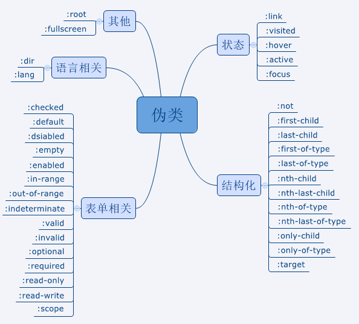

# 伪类
伪类表示`元素的特殊状态`，常见的:

#### 状态

- :link
- :visited
- :link
- :active
- :focus

#### 结构化

- :fitst-child
- :
- :
- :
- :
- :
- :
- :
- :
- :
- :
- :
- :
- :
- :
- :

# 伪元素
伪类与伪元素的区别在于：有没有创建一个文档树之外的元素。

# LVHA(LOVE,HATE)

a链接常见的四个伪类，如下:
- `link`:未访问的链接
- `visited`:表示用户访问过的链接
- `hover`:鼠标悬停的样式
- `active`:鼠标按下和松开的时间段

这四个伪类在写的时候，有顺序要求
需要按照`link visited hover active`的顺序写，便于记忆:`LOVE HATE`

# selector:nth-child(an+b) && selector:nth-of-type(an+b)

这两个伪元素很相似

child的流程是

- 1、根据`selector`选中元素
- 2、`选中元素分别找到对应的父元素`
- 3、`跟据父元素找到符合an+b的子元素`
- 4、判断找到的子元素是否符合`selector`

type的流程是

- 1、根据`selector`选中元素
- 2、`选中元素分别找到对应的父元素`
- 3、`在子元素中，根据selector选择子元素`
- 4、`判断是否符合an+b`

相同点
- selector选择器都用了两次

不同点:

- 3,4两步，顺序颠倒了

# links

- [http://www.alloyteam.com/2016/05/summary-of-pseudo-classes-and-pseudo-elements/](http://www.alloyteam.com/2016/05/summary-of-pseudo-classes-and-pseudo-elements/)
- [https://developer.mozilla.org/zh-CN/docs/Learn/CSS/Introduction_to_CSS/Pseudo-classes_and_pseudo-elements](https://developer.mozilla.org/zh-CN/docs/Learn/CSS/Introduction_to_CSS/Pseudo-classes_and_pseudo-elements)
- [https://blog.csdn.net/wumenglu1018/article/details/54603109](https://blog.csdn.net/wumenglu1018/article/details/54603109)