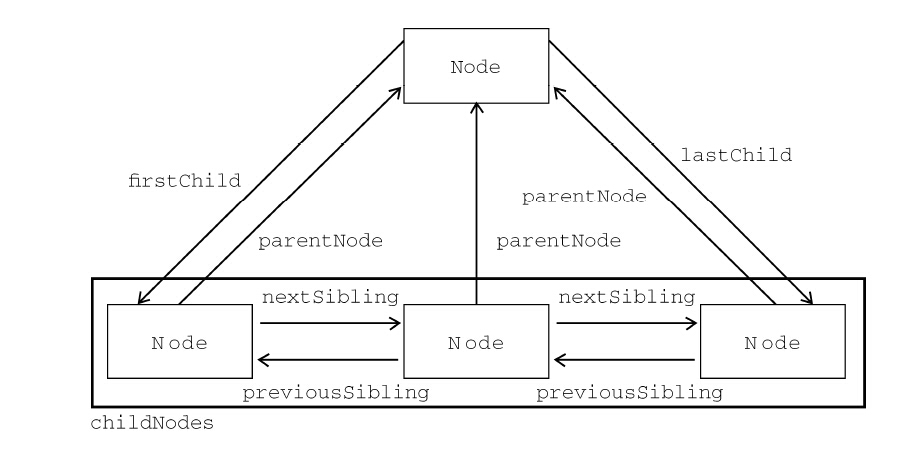

# NODE

node对象是所有dom对象的祖先，这个对象挂在的属性和方法，每个DOM对象都拥有

有

- Node类型
- NodeName:
- NodeType:返回Node类型
- NodeValue
- NODE关系:添加，删除，替换，子节点，兄弟节点

# 节点类型


- Node.ELEMENT_NODE(1)；
- Node.ATTRIBUTE_NODE(2)；
- Node.TEXT_NODE(3)；
- Node.CDATA_SECTION_NODE(4)；
- Node.ENTITY_REFERENCE_NODE(5)；
- Node.ENTITY_NODE(6)；
- Node.PROCESSING_INSTRUCTION_NODE(7)；
- Node.COMMENT_NODE(8)；
- Node.DOCUMENT_NODE(9)；
- Node.DOCUMENT_TYPE_NODE(10)；
- Node.DOCUMENT_FRAGMENT_NODE(11)；
- Node.NOTATION_NODE(12)

# NODE.nodeType,NODE.nodeValue,NODE.nodeName

这三个属性没什么好说的


NODE.nodeValue，一般都为空，只有节点是`文本节点，注释节点`才不为空


# NODE关系

通过NODE的属性，可以在节点中`游走`



- childNodes
- firstChild
- lastChild
- nextSibling
- previoutSibling

注意，NODE获得元素不一定都是ELEMENT，可能有文本节点，注释节点等，不纯粹，后面有解决方法

方法

- appendChild():
- insertBefore():
- replaceChild():
- cloneNode():
- normalize():
- removeChild():

示例代码

```
<div id="box">
    <span>111</span>
    <span>222</span>
    <span id="t3">333</span>
    <span>444</span>
    <span>555</span>
    <span>666</span>
</div>
```

```
let box=document.getElementById('box');
let t3=document.getElementById('t3');

let new_span=document.createElement('span');
let text=document.createTextNode('new span');
new_span.appendChild(text);
// box.appendChild(new_span);
// box.insertBefore(new_span,t3);
// box.replaceChild(new_span,t3);
// let clone_node=t3.cloneNode(true);
// box.appendChild(clone_node);
// box.removeChild(t3);

console.log(new_span.childNodes.length);
let text2=document.createTextNode("text2");//1
new_span.appendChild(text2);
console.log(new_span.childNodes.length);//2
new_span.normalize();
console.log(new_span.childNodes.length);//1
```

这里需要说的是

### NODE.cloneNode()

参数不传的话(默认为false)，会只克隆节点本身，不包括子节点

true表示克隆子节点

### NODE.normalize()

规范化

```
var wrapper = document.createElement("div");

wrapper.appendChild(document.createTextNode("Part 1 "));
wrapper.appendChild(document.createTextNode("Part 2 "));

// 这时(规范化之前),wrapper.childNodes.length === 2
// wrapper.childNodes[0].textContent === "Part 1 "
// wrapper.childNodes[1].textContent === "Part 2 "

wrapper.normalize();
// 现在(规范化之后), wrapper.childNodes.length === 1
// wrapper.childNodes[0].textContent === "Part 1 Part 2"
```


# links
- [https://developer.mozilla.org/zh-CN/docs/Web/API/Node/normalize](https://developer.mozilla.org/zh-CN/docs/Web/API/Node/normalize)
