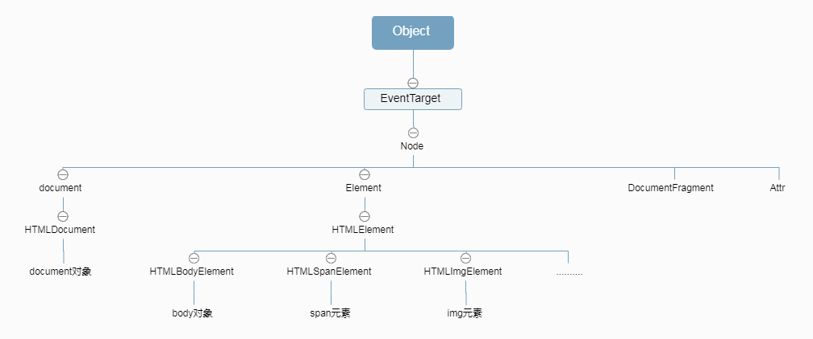

# 浏览器渲染


一切都得从这个图说起

这张图有html和css，但是没有js

dom则是为了js操作html而特意设计出来的接口

可见，dom是html和js的桥梁

# 历史
DOM(document object model)文档对象模型，是一种操作HTML、XML的接口,由于历史原因，分成了1，2，3三个版本，现在浏览器基本都支持最新的dom3

## DOM1

定义了最基本的功能:

- 定义了文档结构

- 提供了查询接口

DOM1可以分为两个两个:Dom Core模块,DOM HTML模块

Dom Core模块定义了文档结构，映射关系，基本操作等

DOM HTML模块则在 DOM Core的基础上进行了补充，更加方便html操作


## DOM2 

DOM2在DOM1的基础上，添加了很多功能

- 事件
- 样式
- 遍历功能
- ........

## DOM3

又继续补充:

- getComputedStyle()
- 元素大小


## HTML5和社区

- querySelector()
- classList
- ......

------------------
可以看到，DOM1的时候，是没有css，事件等事情的，dom2才添加上去，dom3又继续添加了更多的功能

DOM1确定了最基本的功能


# DOM1 - 文档结构

这dom1中，将html，xml表示成为一个树形的数据结构

每个节点，按照数据类型有细分为多种类型，有


- Node.ELEMENT_NODE(1)；
- Node.ATTRIBUTE_NODE(2)；
- Node.TEXT_NODE(3)；
- Node.CDATA_SECTION_NODE(4)；
- Node.ENTITY_REFERENCE_NODE(5)；
- Node.ENTITY_NODE(6)；
- Node.PROCESSING_INSTRUCTION_NODE(7)；
- Node.COMMENT_NODE(8)；
- Node.DOCUMENT_NODE(9)；
- Node.DOCUMENT_TYPE_NODE(10)；
- Node.DOCUMENT_FRAGMENT_NODE(11)；
- Node.NOTATION_NODE(12)


注意，直到这里，仅仅是规定了节点的类型，并不涉及到js

而我们需要使用js来操作网页，而这中间就是dom

```
js------>Dom---->网页
```


设计思路是设计一些基础的对象:

比如`document`表示html文档，`history`表示浏览器历史
，`screen`表示屏幕等等

这里设计到DOM和bom，先只说DOM

js先创建一个对象`NODE`，表示`节点`,所有的DOM节点都继承自它

然后根据不同的需求，分别创建不同的对象来表示不同的html标签，比如`img`标签在js中的对象是`HTMLImgElement`

同时，DOM2中引入了事件机制，所有所有的节点都应该继承自`事件机制`


这样从js的角度看，会形成这样一种继承图




这张图不全面，每一个NODE类型，都对应一个JS对象


每个js对象有什么方法和属性，后面说


# DOM1-查询接口

DOM1中的查询结构就是两个方法`getElementById()`,`getElementByTagName()`

`getElementById`返回的结果是是对应的dom对象

`getElementByTagName()`返回的则是一组dom对象

这里就有问题了，这组对象是什么类型的呢？

最简单的应该是数组，但是数组使用有局限(比如方法的挂载就不方便)，所以得是一个自定义的对象

## DOM中的集合类型

在dom中，有很多属性和方法，返回的都是一组对象

而这一组的类型会主要分为

- NodeList
- HTMLCollection
- NamedNodeMap
- DomTokenList


--------------------------------

这里的js表示的对象一般称为`DOM对象`,集合一般称为`DOM集合`,`DOM对象集合`


# 性能
由于DOM元素的继承关系，所以开销非常大

比如,img元素

```
HMTLImgElement->HTMLElement->Element->Node->EventTarget->Obj
```
一个普通的dom元素，都是有6个原型，每个原型都挂载了大量的方法和属性

这就是为什么不建议直接操作DOM

REACT的`虚拟DOM`，就是为了解决这样的问题，虚拟dom只保留了最最基本的内容，REACT性能高就是这个原因


# 其他

- [Node](./DOM/Node.md)
- [Document](./DOM/Document.md)
- [Node](./DOM/Node.md)
- [Node](./DOM/Node.md)
- [Node](./DOM/Node.md)


# NODE类型（NODE接口）
html中的所有元素都是NODE类型的，也就是说，node拥有的属性和方法，其他元素都会拥有

## 属性
- nodeType,nodeValue:类型和数值
- childNodes,parentNode,previousSibling,nextSibling,firstChild,lastChild:结构和关系
- owerDocument:整个文档的文档节点，就是document
- 
- 
- 
- 
- 
- 
- 
## 方法
- hasChildNodes(): 相当于!!childNodes.length
- appendChild(),insertBefore(),replaceChild(),removeChild(),cloneNode(),
- normalize():将相邻文本节点合并
- 
- 
- 
- 
- 
### replaceChild()


### childNodes
返回的结果是一个NODELIST对象，NODELIST是一个类数组对象，并且很重要的一点，这个对象是有生命、有呼吸的对象，而不是在我们第一次访问它们的某个瞬间拍摄下来的一张快照。


# Document类型（Document接口）
JavaScript 通过Document 类型表示文档,在浏览器端，document对象就是其一个示例，但是其构造函数确实HTMLDOCUMENT,HTMLDOCUMENT继承了DOCUMENT接口

## docunent对象
document在浏览器端表示一个整个html页面，该对象上挂载了很多属性和方法

### 属性
- document.documentElement:
- document.title:
- document.head:
- document.body:
- document.doctype:
- http相关
    - document.URL/URI:
    - document.domain:
    - document.referrer:

- 特殊集合
    - document.anchors:
    - document.forms:
    - document.images:
    - document.links:


- 
- 
### 方法
- document.getElementById():
- document.getElementsByTagName():
- write()、writeln()
- open()和close()
- createElement()
- createTextNode()


# Element类型(Element接口)
Element 类型用于表现HTML元素，提供了对元素标签名、子节点及特性的访问

所有HTML 元素都由HTMLElement 类型表示，不是直接通过这个类型，也是通过它的子类型来表
示。HTMLElement类型直接继承自Element 并添加了一些属性，有
- id
- title
- className
- 等等

所以，举个例子来说，html标签a，继承链应该是:
a----HTMLAnchorElement----HTMLELEMENT----ELEMENT----NODE;
p----HTMLParagraphElement----HTMLELEMENT----ELEMENT----NODE;


# html标签属性
html元素通过这三个方法获取标签
getAttribute()、setAttribute()和removeAttribute()

实际上标签名称可以直接通过元素属性的方式访问，比如
```
ele.align ，ele.width
```
但是这种方式只对html中公认的标签合适，自己定义的标签无法通过这种方式获取
当然，在html5中，通过data-的方式定义的属性，可以通过
```
ele.dataset.xxx
```
来获得

------
但是，ele.xxx和ele.getAttribute(),在如下情况下不一致
```
ele.onclick//返回的是一个函数,还有其他事件都是如此
ele.style//返回的是一个对象
ele.getAttribute()//返回的是字符串
```

所以，可以看到，基本上，除了获取自定义属性以外，其他情况基本都可以通过对象属性的方式获取更好


# TEXT类型(TEXT接口)
文本节点，只能是纯文本
常用方法
- appendData()
- deleteData()
- insertData()
- 等等

document.createTextNode()


# DocumentFragment类型
文档片段，简单说就是一个小容器，但是不会出现在文档中，通过它的来进行dom操作，由于不用实时反馈到文档中，所以性能很高
通常，通过它来实现将多个dom操作合并成一个fragment，然后统一反馈到文档中


-----------------
综上：DOM1就规定了最基本的东西

# DOM扩展
来源于开发社区，将一些新东西加进了dom标准，有
- Selectors API(选择符API)
- html5
- Element Traversal(元素遍历)

## Selectors API
主要加了这几个方法
- querySelector()
- querySelectorAll()
- matchesSelector()

## Element Traversal(元素遍历)
之前要遍历子元素的话，会很烦烦，要判断节点是否是元素节点(过滤掉空格的空元素)，现在可以通过该属性，方便遍历了，因为这些熟悉只包含元素类型的元素
这个规范为DOM元素添加了以下5 个属性
- childElementCount：===node.children.length
- firstElementChild:==firstChild 的元素版
- lastElementChild：lastChild 的元素版。
- previousElementSibling：previousSibling 的元素版。
- nextElementSibling：nextSibling 的元素版。


## HTML5
html5范围很大，这里直说和dom相关的
html5中新加了很多api,有:

- getElementsByClassName()
- classList属性：将className当作对象来操作，之前只能当作字符串，很麻烦
 - add()
 - contains()
 - remove()
 - toggle()
- document.activeElement:当前获得焦点的元素
 - document.hasFocus()：通过检测文档是否获得了焦点，可以知道用户是不是正在与页面交

HTML5 扩展了HTMLDocument，增加了新的功能
- readyState:
- head 属性:作为对document.body 引用文档的<body>元素的补充
- charset:
- dataset:自定义data属性
- innerHTML:
  - 插入的代码会被序列化
  - script标签不会被执行
  - 并不是所有元素都支持innerHTML 属性：<frameset>、<head>、<html>、<style>、<table>等
- outerHTML:自身+innerHTML
- insertAdjacentHTML()
- element.scrollIntoView():让element出现在视野中


# DOM2 && DOM3
对DOM1的补充：
- getComputedStyle()
- 元素大小

## 元素大小
DOM中没有规定如何确定页面中元素的大小
- 偏移量:元素在屏幕上占用的所有可见的空间
    - offsetHeight:元素在垂直方向上占用的空间大小
    - offsetWidth:元素在水平方向上占用的空间大小
    - offsetLeft:元素的左外边框至包含元素的左内边框之间的像素距离
    - offsetTop:
    - offsetParent:offset中的包含元素的引用
- 客户区大小:元素内容及其内边距所占据的空间大,(不包含border)(从字面上看，客户区大小就是元素内部的空间大小，因此滚动条占用的空间不计算在内)
    - clientWidth:元素内容区宽度加上左右内边距宽度；
    - clientHeigh:元素内容区高度加上上下内边距高度
- 滚动大小:包含滚动内容的元素的大小
    - scrollHeight:在没有滚动条的情况下，元素内容的总高度
    - scrollWidth:在没有滚动条的情况下，元素内容的总宽度。
    - scrollLeft:被隐藏在内容区域左侧的像素数
    - scrollTop:：被隐藏在内容区域上方的像素数
   
scrollWidth 和scrollHeight 主要用于确定元素内容的实际大小
