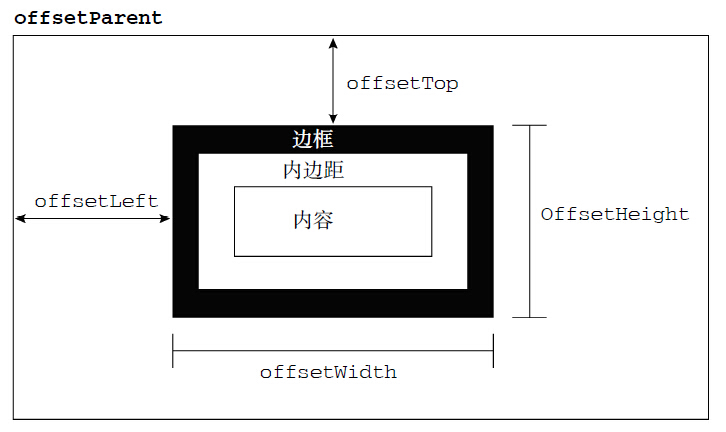
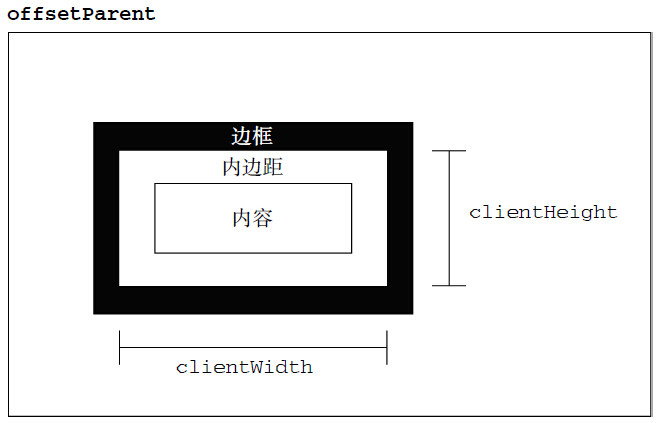
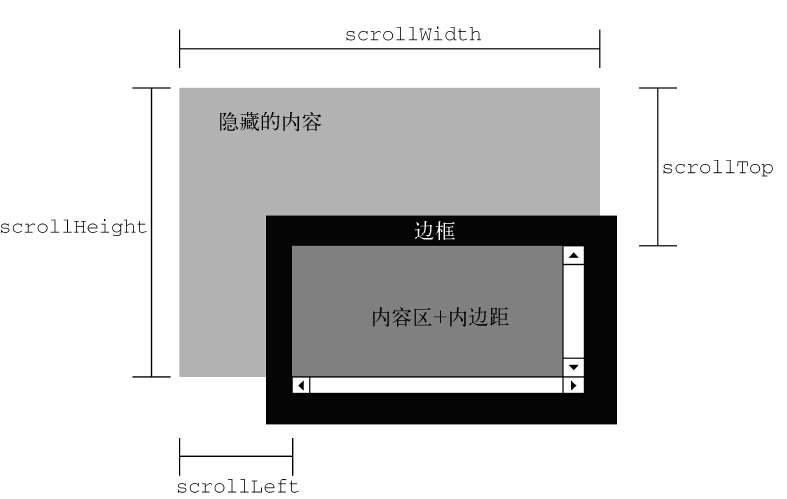

# 元素大小
DOM中没有规定如何确定页面中元素的大小,偏移等信息

ie8中才引入

主要有

- 偏移量
- 客户区大小
- 滚动大小

# 偏移量

这里有一个offsetParent(定位父级)的概念，后面说

偏移量属性表示的是`元素在屏幕上占用的可见空间`,是最常用的属性

# 客户区大小

只有两个属性，和`offsetWidth`，`offsetHeight`的区别就是`没有算边框`

客户区大小表示的是`元素内部的空间大小`,所以是不计算边框的

# 滚动大小

这些属性表示的是`包含滚动内容元素的大小`

> 这里的`scrollTop`,`scrollLeft`是可以设置的，以上其他所有的属性都是不可以设置的

# offsetParent

offsetParent是元素的一个属性,返回的元素，是`离自己最近的，经过定位的元素`

有如下几种情况

#### 子元素fixed定位
offsetParent是`null`
#### 子元素没有fixed定位
offsetParent是`距离自己最近的，有,abslote,relative,fixed`的父元素，如果都没有定位，那么这个属性返回的是`body`元素

# js特效

如果只是使用上面几个属性的话，那么`scrollTop`,`scrollLeft`应该是使用最多的，因为只有这两个属性是可以设置数值的

# 案例

### 1、放大镜
### 2、瀑布流
### 3、懒加载

# links

- [https://www.jianshu.com/p/41ff1d103d3f](https://www.jianshu.com/p/41ff1d103d3f)

- 偏移量:元素在屏幕上占用的所有可见的空间
    - offsetHeight:元素在垂直方向上占用的空间大小
    - offsetWidth:元素在水平方向上占用的空间大小
    - offsetLeft:元素的左外边框至包含元素的左内边框之间的像素距离
    - offsetTop:
    - offsetParent:offset中的包含元素的引用
- 客户区大小:元素内容及其内边距所占据的空间大,(不包含border)(从字面上看，客户区大小就是元素内部的空间大小，因此滚动条占用的空间不计算在内)
    - clientWidth:元素内容区宽度加上左右内边距宽度；
    - clientHeigh:元素内容区高度加上上下内边距高度
- 滚动大小:包含滚动内容的元素的大小
    - scrollHeight:在没有滚动条的情况下，元素内容的总高度
    - scrollWidth:在没有滚动条的情况下，元素内容的总宽度。
    - scrollLeft:被隐藏在内容区域左侧的像素数
    - scrollTop:：被隐藏在内容区域上方的像素数
   
scrollWidth 和scrollHeight 主要用于确定元素内容的实际大小
