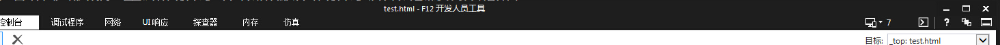

# 文档模式

正常情况下，如果设置了doctype，那么就按照doctype来进行渲染就可以了

但是由于有历史原因，早期的渲染方式和现在的渲染模式是截然不同的

可以简单分为:

- 标准模式(符合w3c标准的渲染模式，不同的ie有不同的标准模式)
- 怪异模式(早期的渲染方式,按照现在的眼光看待是`怪异的`,准确的说是ie5.5的标准渲染方式)

为了兼顾早期的网页，`默认得是怪异模式`

---------------

如果不规定浏览器使用什么模式渲染，那么浏览器会`通过doctype`来进行判断，`选择最合适的模式渲染`

也可以自行指定渲染模式

# 第一种方式

```
<meta http-equiv="X-UA-Compatible" content="IE=7">
```
通过这个标签，可以确定`使用哪个标准的渲染模式`


注意其中的数值:

- EmulateIE7：如果有文档类型声明，则以IE7 标准模式渲染页面，否则将文档模式设置为IE5。
- 7：强制以IE7 标准模式渲染页面，忽略文档类型声明。

对比这两个，可以看到，通过这个meta标签，是可以忽略`doctype`的

# 第二种方式

ie手动修改




# 第三种方式

设置 http response header 


```
X-UA-Compatible:Edge
```
通过这种方式设置，级别没有meta标签设置高


# links

- [https://www.cnblogs.com/fsjohnhuang/p/3817418.html](https://www.cnblogs.com/fsjohnhuang/p/3817418.html)