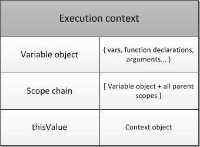

# 执行上下文栈

在js中，一共有三种作用域`global,function,eval`

而底层实现的方式，是使用`执行上下文(execution context，EC)`，执行上下文可以理解为一个对象

这样就可以分为`global exection context`,`function execution context`,`eval execution context`

------------------------

一个EC可以调用另外一个EC，两者关系是`caller,callee`的关系

当caller调用callee的时候，caller会暂停，将控制权交给callee

callee结束后，caller会收回控制权，caller继续执行后续内容

-------------------

通过caller和callee的关系，global EC一定是第一个，然后global EC会调用其他的EC

这样会形成一个`EC stack`(执行上下文堆栈)

global EC在最底下，一个EC被调用后，就会被压入 EC stack，执行完成后，就会被弹出

# 执行上下文

执行上下文包含三部分

- variable Object,[变量对象](./JAVASCRIPT/变量对象.md)
- scope chain ,[作用域链](./JAVASCRIPT/作用域链.md)
- this ,[THIS](./JAVASCRIPT/THIS.md)

-----------

执行上下文到底是个什么东西？

其实也好理解，代码执行的时候，需要的所有东西，这些东西打包到一起，就是执行上下文

