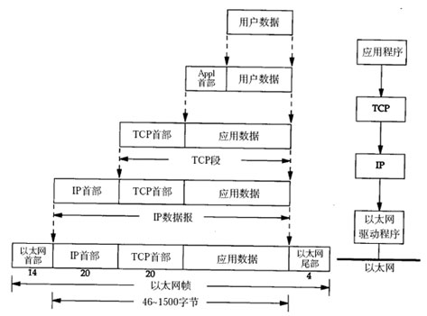

# 分层

计算机网络很复杂,需要分开看

人们提出了层层抽象的思想

主要抽象成这几层

## 第一层(物理层)

先将所有的物理设备抽象成一层，比如网卡，网线，路由器等等物理设备

一般叫做 `物理层`

这一层只关心物理层面的内容，比如网线规格，接线口规格

在这层基础之上再研究，就不用关心物理层面的问题了

## 第二层(数据链路层)


在物理层之上，那么就可以发送信息了，但是还有好多问题


## 如果一个网络中有10台计算机，如果可以做到这些计算机之间相互通信？

思路很简单，每台计算机，扯出十条线分别连接每台计算机就可以了

但是随着计算机的增加，线路也会增加，不实际

还有一个问题，同一时间只能有一个节点发送信息


后来发明了`交换机`解决了这个问题

## 交换机

交换机的工作原理也很简单，自己维护一张mac表，里面记录着连接自己的计算机的mac地址

刚开始这个表是空的，交换机就通过广播的形式，来采集mac地址

a发送数据给b，交换机只需要查找d的mac地址，然后将数据通过b连接交换机的接口发出即可

一个网络中的所有计算机，连接到交换机，即可实现对所有计算机之间的连接


### 这个网络中的a给b怎么发送消息？

每台计算机上都有一个网卡，网卡有一个唯一的编号`mac地址`，全球网卡编号都唯一

a给b发送消息，思路也很简单，`广播`

a将消息发送给交换机，交换机会给这个网络中的每个计算机发送这条消息

发送的消息有发送者的mac地址和接受者的mac地址

每台计算机收到消息后，查看自己的mac地址，如果不是就直接忽略，如果是自己的，就接收

------------------------

至此，一个小型的网络就搭建起来了,

还有得有一种协议，规定:

- 物理层的010101多少个是一组(帧)
- 一个帧里面，那些部分是数据，哪些部分是MAC地址

最后有一种协议`Ethernet`称为了主流标准


# 第三层(网络层)

第二层的那个网络不能太大，因为每次通信都靠广播，多了的话，光判断是不是自己的消息了

所以，这个网络不能太大

这样就形成了一个一个的小网络

这种小网络叫做`局域网`

### 那么小网络之间怎么通信呢？

思路也简单

继续抽象一层，将所有的计算机想象成一个网络上的一个节点，这个网络就是`广域网`，连在这个网上的计算机，都有一个唯一的编号(IP地址)

### 广域网还能不能广播了?

不能了，如果继续广播，计算机太多了，没法广播，否则就彻底乱了

-----------

当时人们的目标是建立一个可以无限扩充的网络，所有的计算机(节点)都连接在一起

为了实现这个目标，思路是这样的

- 1、所有的节点都有一个唯一的编号

- 2、广域网中的节点a想要发送数据给节点b，不能直接发送，交给第三方发送

- 3、这个第三方使用自己的方式来发送数据

### 这个第三方怎么发送数据？

思路:

- 1、第三方(r表示)不是一个，得是一群，统称第三方

- 2、比如r5的上家是r1,r2,下家是r6,r7,r5从上家接到数据，转发给下家就可以了

- 3、如此接力，一个一个传下去，就可以实现了只要通过这个第三方，那么就可以实现点对点的通信

这个第三方，就是路由器,它是这层的核心

#### r5收到数据，怎么知道给哪个下家?

r5维护了一张路由表，通过这张表可以得出给哪个下家

其实这是一个`路由寻址`的问题，很复杂

总的来说，就是维护一张路由表，这个表里面会记录最优的传递下家

并且这个表也是会定时更新的，逐渐优化传递下家


涉及到的协议也很多，这个问题是这层最主要解决的问题


可以看到这层的主要目的就两个

- 确定网络节点(ip地址)

- 确定最优传输路径(路由寻址)

著名的协议是`IP`协议，就是完成第一个目标

第二个目标(确定最优路径),设计到的协议很多，比如(RIP,ICMP等)


# 路由器，怎么知道它自己和谁相连接，怎么发送消息?

这个其实得靠数据连接层所建立起来的`结构图`,靠广播，通过制定相关协议，就可以知道自己和谁相连


### 路由器为什么不是交换机?

交换机每次发送信息都得靠广播

路由器则不是，比交换机高明一些，也就改进在这里了

但是路由器发送的其实本质上还是0101，还是得靠mac地址来确定下家


#### 发送的数据包里面只有目标ip地址，但是到了子网中传递数据只能使用mac地址传递,怎么传递到具体的计算机

思路也简单，

在内网中广播指定ip对应的mac地址是多少，查到ip后就可以在子网中发送

或者就直接给这个网络的网关

这个就是`ARP`协议的简单原理


## 第四层

照理说有了上面的三层，就够用了，已经实现了连接在网络上的计算机之间通信了

但是计算机还有进程，上面两层只是将信息发送给计算机，但是没有发送给具体进程

而这一层就是要解决这个问题

思路是再提供一层抽象，提供一些端口号对应不同的进程，就可以实现进程之间的通信了

这一层一般叫做 `传输层`

这层的主要作用就是实现端口号之间的通信

而上一层，实现了计算机和计算机之间的通信

所以，只要确定了主机和端口，就可以实现进程间的通信，所以在unix系统中，将`主机+端口=socket`


著名的协议是`TCP`,`UDP`两个协议(这一层的协议都得有端口号)


TCP稳定可靠，但是速度慢，UDP不可靠，但是速度快

## 第五次

有了上面的4层，基本的使用是足够了

但是随着发展，需求变得更多了，比如发邮件，浏览远程计算机的文件，远程登录等等，这些需求极为常见


也有必要形成统一的规则，方便计算机和计算机收发邮件等

但是这仅仅是为了方便，因为上面三层已经将所有的基本功能都实现了，使用上面三层就可以满足需求

这一层一般叫做 `应用层`

协议很多，都是一个协议针对一个特定的应用领域，比如

POP3协议针对邮件发送

ftp协议针对文件传输

这一层最著名的就是`HTTP`，超文本传输协议，它是www的基础

----------------

ISO组织也做出了一个封层模型，分的更细致 ，这就是著名的  `OSI/七层模型`

- 物理层：底层数据传输，如网线；网卡标准。 
- 数据链路层：定义数据的基本格式，如何传输，如何标识；如网卡MAC地址。
- 网络层：定义IP编址，定义路由功能；如不同设备的数据转发。
- 传输层：端到端传输数据的基本功能；如 TCP、UDP。
- 会话层：控制应用程序之间会话能力；如不同软件数据分发给不同软件。
- 标识层：数据格式标识，基本压缩加密功能。
- 应用层：各种应用软件，包括 Web 应用。


按理说应该按照上面的分层逐层指定对应的协议，但是实际上，在实现上，使用四层的更简单，比如标示层，加密解密功能可以和其他层一起实现，简单说，按照它的模型研究可以，但是按照它的模型来实际去做，就会很麻烦

----------
自己总结网络模型各层的作用

- 物理层:提供物理硬件支持
- 数据链路层:确定数据传输格式，确定`网络拓扑图`，实现局域网数据通信
- 网络层:将全球所有计算机连为一体,提供全球计算机之间数据传输方式
- 传输层:提供进程之间的数据传输方式
- 应用层:提供常见通信协议之间的数据传输方式

# 数据格式



由于最底层是0101传递的，每一层都有抽象

### 物理层:
```
0101010101010101010
```
### 数据链路层
将01010抽象成
```
[mac地址][data]
```
### 网络层

```
[mac地址][ [ip地址][网络层数据]    ]
```

### 传输层

```
[mac地址][ [ip地址][ [port号][传输层数据]   ]    ]
```

### 应用层

```
[mac地址][ [ip地址][ [port号][ [协议][data]  ]   ]    ]
```

-------------

数据链路层一个数据包，是有大小限制的，因为物理层是不稳定的，不能无限长度，一般是4000bit

而网络层，每个数据包则更小

同理，层数越高，所携带的数据越小

也就是说，不能一直分层，最后可能导致数据段长度为0

# 一个http请求，最多能携带多少数据，才能使用一个数据链路层的数据包(一帧)来发送

以太网数据包的负载是1500字节

TCP 数据包的负载在1400字节左右

http请求的由请求头和请求体共同组成，而请求头所携带的信息是可多可少的，代表不同的功能

```
GET /?tn=98012088_10_dg&ch=3 HTTP/1.1
Host: www.baidu.com
Connection: keep-alive
Cache-Control: max-age=0
Upgrade-Insecure-Requests: 1
User-Agent: Mozilla/5.0 (Windows NT 6.1; WOW64) AppleWebKit/537.36 (KHTML, like Gecko) Chrome/71.0.3578.98 Safari/537.36
Accept: text/html,application/xhtml+xml,application/xml;q=0.9,image/webp,image/apng,*/*;q=0.8
Accept-Encoding: gzip, deflate, br
Accept-Language: zh-CN,zh;q=0.9
Cookie: PSTM=1547107851; BIDUPSID=0338177BED3833852F7CF202A2BAB223; BD_UPN=12314353; BDORZ=B490B5EBF6F3CD402E515D22BCDA1598; BAIDUID=460BED9B66CE97D2AE495F5C56562452:FG=1; delPer=0; BD_CK_SAM=1; PSINO=5; BDRCVFR[f83LjLo_kJ6]=mk3SLVN4HKm; BD_HOME=0; H_PS_PSSID=
```
这个是百度的请求头,700多的长度

天猫的是900左右

谷歌的是500左右

-------------

总的来说，一般情况下，一次数据少于400byte的话，可以保证一个链路层帧携带一个http请求


